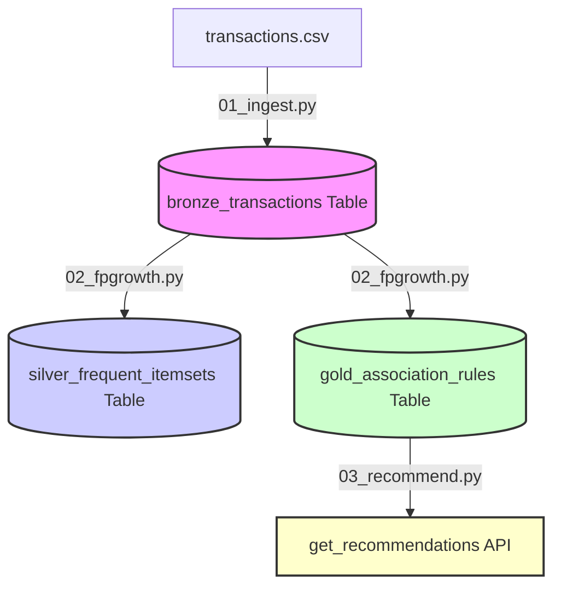

# 🛍️ Customer Affinity & Basket Analysis (CI-360) Solution Accelerator

<p align="center">
  
  
  
  
</p>

[](https://databricks.com/)
[](https://spark.apache.org/)
[](https://delta.io/)
[](https://www.python.org/)

An automated pipeline for cross-sell product recommendations, market basket analysis, and transaction affinity mining. Built on **Azure Databricks** and **Delta Lake**, this accelerator aggregates raw transactions, trains a Spark MLlib FP-Growth (Frequent Pattern Growth) association model, writes optimized Delta Lake tables, and serves order-insensitive product suggestions.

Designed and developed by **Arghyadeep Paul** (*Associate Technical Consultant – Data Analytics & AI*), certified Databricks Data Analyst Associate.

---

> [!TIP]
> 🤝 **Open-Source Contributors Welcome!**
> 
> This repository is a functional solution accelerator template. We are seeking open-source contributions to build out production UI modules and alternative algorithm layers! Read the [Contributing](#-contributing--open-source-help-needed) section below.

---

## 🏗️ 1. Medallion Ingestion & Mining Pipeline

The solution accelerator implements an automated Bronze $\rightarrow$ Silver $\rightarrow$ Gold data pipeline:



*   **Bronze Ingestion**: Enforces strict transactional schemas on incoming CSV/raw files, enables Change Data Feed (CDF) for downstream incremental processing, and Z-Orders the Delta tables by `transaction_id`.
*   **Silver Mining**: Groups items into arrays per unique transaction ID to build "shopping baskets". Applies Apache Spark MLlib's `FPGrowth` algorithm to discover frequent itemsets.
*   **Gold Serving**: Extracts association rules (LHS $\rightarrow$ RHS) representing cross-sell affinities, optimizes index searches by Z-Ordering the output table by `confidence` and `lift` metrics, and exposes a serving lookup API.

---

## ⚙️ 2. Master Orchestrator: `RUNME.py`

The accelerator utilizes a master runner notebook (`RUNME.py`) which orchestrates the pipeline activities sequentially using `%run` commands:

1.  **`notebooks/01_ingest`**: Enforces schema rules and creates the Bronze Delta table.
2.  **`notebooks/02_fpgrowth`**: Computes Silver frequent itemsets and Gold association rules.
3.  **`notebooks/03_recommend`**: Demonstrates the recommendation serving engine (Checkout & Rewards demos).

---

## 💻 3. Core PySpark & Spark ML Logic

### 1. Schema Enforcement & Z-Ordering (Ingestion)
In `01_ingest.py`, a strict schema is enforced on raw transactions, and the target table is optimized:
```python
# Enforce strict transaction schema
schema = StructType([
    StructField("transaction_id", IntegerType(), False),
    StructField("item", StringType(), False)
])

# Save as optimized Delta table with Change Data Feed enabled
df.write.format("delta") \
    .mode("overwrite") \
    .option("delta.enableChangeDataFeed", "true") \
    .save(delta_path)

# Optimize Z-Ordering on primary search key
spark.sql(f"OPTIMIZE delta.`{delta_path}` ZORDER BY (transaction_id)")
```

### 2. Basket aggregation & FP-Growth Model (Mining)
In `02_fpgrowth.py`, items are collected into baskets, and Spark ML's FP-Growth is trained:
```python
# Collect array of transactional items into shopping baskets
baskets_df = df.groupBy("transaction_id") \
    .agg(F.collect_list("item").alias("items"))

# Train Spark ML FP-Growth association model
fp_growth = FPGrowth(itemsCol="items", minSupport=min_support, minConfidence=min_confidence)
model = fp_growth.fit(baskets_df)

# Write and Z-Order Gold association rules by performance metrics
association_rules = model.associationRules
association_rules.write.format("delta").mode("overwrite").save(gold_path)
spark.sql(f"OPTIMIZE delta.`{gold_path}` ZORDER BY (confidence, lift)")
```

### 3. Order-Insensitive Recommendation Lookup (Serving)
In `03_recommend.py`, the recommendation API sorts the input antecedents so that purchase query order does not affect matching rules:
```python
def get_recommendations(purchase_items, limit=5):
    # Sort user input items to align with sorted antecedent evaluations
    sorted_input = sorted(purchase_items)

    # Sort the stored antecedent arrays in Delta and filter for exact matches
    res_df = rules_df.filter(
        F.array_sort(F.col("antecedent")) == F.array(*[F.lit(x) for x in sorted_input])
    ).sort(F.col("confidence").desc()).limit(limit)

    return res_df
```

---

## 🚀 4. How to Deploy and Run

Follow these steps to deploy and run the solution accelerator in your Databricks workspace:

### Step 1: Upload Assets
1. Clone this repository to your local machine.
2. In your Databricks Workspace, navigate to **Workspace** $\rightarrow$ select your folder or click **Import** to upload `RUNME.py` and the `notebooks/` directory.

### Step 2: Upload Raw Transactions CSV
1. Navigate to the **Catalog** tab in Databricks.
2. Create or navigate to a Unity Catalog Volume (e.g. `main.ci360.raw_data`).
3. Click **Upload to this volume** and upload `data/transactions.csv`.
   * Note the path: `/Volumes/main/ci360/raw_data/transactions.csv`.
   * Alternatively, upload to a DBFS directory (e.g. `dbfs:/tmp/ci360/transactions.csv`).

### Step 3: Run the Pipeline
1. Open the master notebook `RUNME.py`.
2. Attach it to a running Databricks cluster (recommended runtime: **Databricks Runtime (DBR) 13.x+ with Spark 3.4+**).
3. Configure model thresholds using the widgets in notebooks if needed:
   * `min_support` (Default: `0.1` — minimum pattern occurrence percentage).
   * `min_confidence` (Default: `0.5` — minimum probability rule requirement).
4. Click **Run All** on `RUNME.py`. The complete pipeline will execute, and the execution duration telemetry will print at the bottom.

### Step 4: Query Recommendations
Once the pipeline has successfully run, you can import and call the serving function in any python context:
```python
# Example: Fetch recommendations for shoppers buying a laptop
laptop_recommendations = get_recommendations(["laptop"])
display(laptop_recommendations)
```

---

## 🤝 5. Contributing & Open-Source Help Needed!

This accelerator is open-source and welcoming contributions. Help us take it to the next level by building features that expand the scope of Databricks Basket Analysis!

### 💡 Up-For-Grabs Features:
*   [ ] **Databricks App UI**: Design an interactive Streamlit/Databricks App to serve recommendations dynamically (similar to the standard Databricks solutions).
*   [ ] **Collaborative Filtering**: Implement a companion PySpark Alternating Least Squares (ALS) model notebook to compare associations with matrix factorization.
*   [ ] **MLflow Integration**: Set up MLflow tracking in `02_fpgrowth.py` to log parameters (`minSupport`, `minConfidence`) and rule count metrics.
*   [ ] **Sample Data Generator**: Write a synthetic transaction log generator python script to produce large-scale customer transaction data (CSV) dynamically.

**How to contribute**:
1. Fork the repo and clone locally.
2. Implement your features and write test suites.
3. Open a Pull Request!

---

## 📂 6. Project Directory Structure

```
├── Databricks Solutions Accelerator/
│   ├── RUNME.py                       # Master orchestrator notebook (one-click run)
│   ├── notebooks/                     # Step-by-step PySpark notebooks
│   │   ├── 01_ingest.py               # Step 1: Ingests raw data and Z-Orders Bronze tables
│   │   ├── 02_fpgrowth.py             # Step 2: Groups baskets and trains FP-Growth models
│   │   └── 03_recommend.py            # Step 3: Exposes serving recommendation logic
│   ├── data/                          # Folder for local sample transaction files
│   │   └── transactions.csv           # Raw sample transaction logs (CSV)
│   ├── CI360_Campaign_Plan.pptx       # Business Presentation & Campaign Plan deck
│   ├── GitHub_Extraction_Report.md    # Databricks Solutions Catalog reference report
│   ├── databricks.yml                 # Databricks Asset Bundle (DAB) deployment config
│   ├── .gitignore                     # Git exclusion configuration
│   └── LICENSE                        # MIT License
```

---

## 📄 7. License

This project is licensed under the MIT License - see the [LICENSE](LICENSE) file for details.
